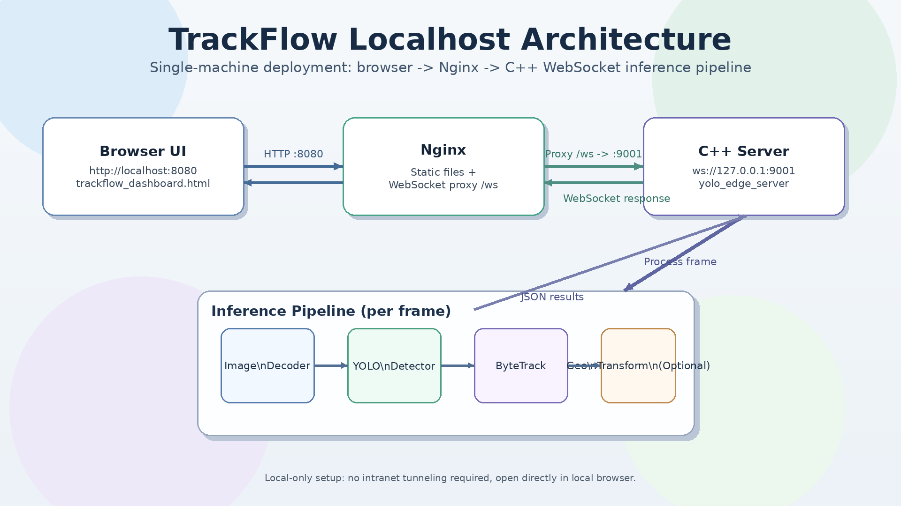

# TrackFlow

TrackFlow 是一个本地部署的实时视频分析系统：浏览器采帧，C++ 后端做检测/跟踪，再把结果实时回传到页面展示。



## 目标场景

- 仅本地使用（`localhost`）
- 新设备可一键准备依赖并构建
- 不依赖内网穿透/公网隧道

## 本地运行架构

- 浏览器页面：`http://localhost:8080/trackflow_dashboard.html`
- Nginx：提供静态文件并把 `/ws` 反代到后端
- C++ 后端：`ws://127.0.0.1:9001`

## 一键部署（新设备）

### 1) 克隆仓库

```bash
git clone https://github.com/iam-xiaofeng/TrackFlow.git
cd TrackFlow
```

### 2) 一键安装依赖 + third_party + 构建

```bash
./scripts/bootstrap_localhost.sh
```

这个脚本会依次执行：

- `scripts/install_deps.sh`
- `scripts/install_onnxruntime.sh`
- `scripts/install_uwebsockets.sh`
- `scripts/build.sh Release`

### 3) 一键启动本地服务

```bash
./scripts/run_localhost.sh
```

启动成功后，直接在本机浏览器打开：

- `http://localhost:8080/trackflow_dashboard.html`

兼容入口仍可用：

- `http://localhost:8080/test_v5.html`

## 必要目录（建议上传）

只保留运行必需内容：

- `CMakeLists.txt`
- `src/`, `include/`
- `config/`
- `scripts/`
- `deploy/nginx/`
- `frontend/`
- `trackflow_dashboard.html`
- `test_v5.html`（兼容跳转页）
- `favicon.ico`
- `README.md`

## 不建议上传的内容

以下内容与核心运行无关或可再生成，建议不要入库：

- 大体积媒体文件（`*.mp4`, `*.avi`, `*.mov`, `*.mkv`）
- 构建产物（`build/`）
- 本地缓存（`.cache/`, `__pycache__/`）
- third_party 下载产物（`third_party/onnxruntime*`, `third_party/uWebSockets/`）

说明：`third_party` 在新设备上可通过脚本自动下载/编译，不必上传到 GitHub。

## 常用命令

### 手动构建

```bash
mkdir -p build && cd build
cmake -DCMAKE_BUILD_TYPE=Release ..
make -j"$(nproc)"
```

### 手动启动后端

```bash
./build/yolo_edge_server -c config/config.yaml
```

### 关闭后端

```bash
pkill -f ./build/yolo_edge_server
```

## 页面命名说明

- 正式页面：`trackflow_dashboard.html`
- 历史名称：`test_v5.html`（目前仅做跳转兼容）

## 已知前提

- 默认模型路径：`models/3class410.onnx`
- 如果模型不存在，需自行放入 `models/` 后再启动
- 本文只覆盖本地 `localhost` 联调，不包含内网穿透方案
